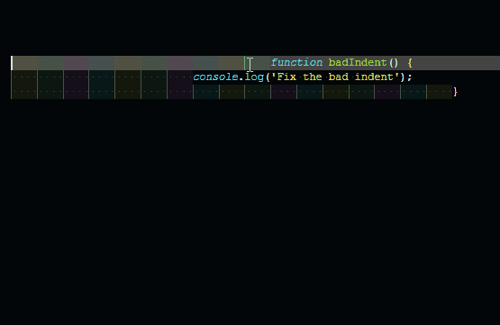

# indent-line README

An extension to indent lines to correct level.

## Features

It supports the following commands:

- Indent line               (windows: `cmd+alt+[` , mac: `cmd+option+[` )

- Indent line and next line (windows: `cmd+alt+]` , mac: `cmd+option+]` )

## Known Issues

No known issues.

## Release Notes

### 1.0.0

Initial release